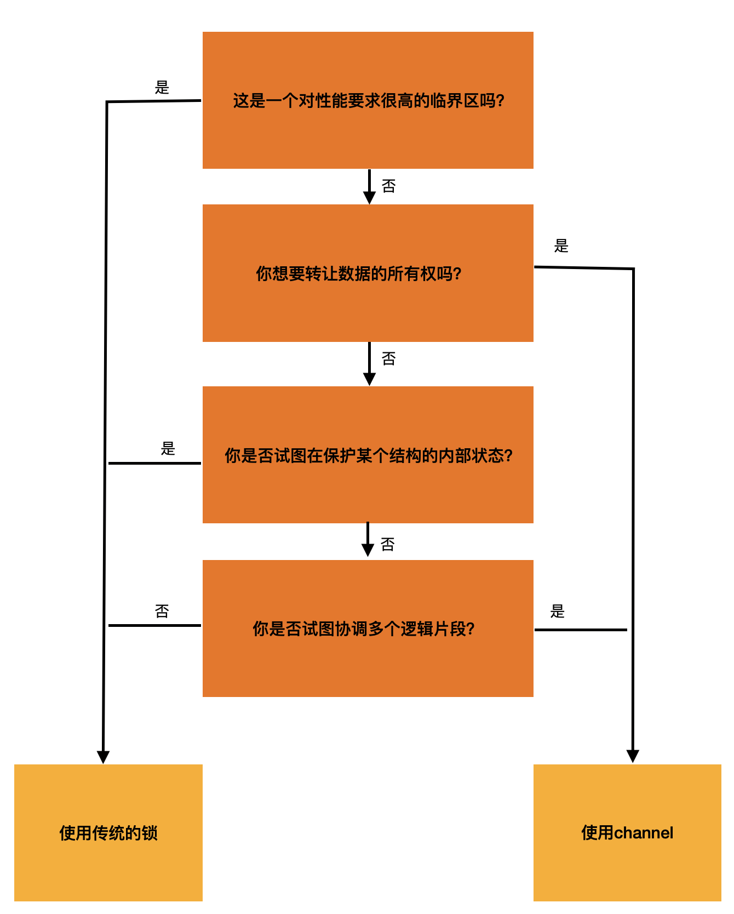

# Part 1: Concurrency in Golang

## 并发（Concurrency） vs 并行（Parallelism）


## 通信顺序进程（Communicating Sequential Processes，CSP）

Original paper: [Charles Antony Richard Hoare, 1978]

- *与共享内存的方式不同，CSP基于通信的方式处理并发问题*

- 并发的核心问题是*同步（Synchronization）*
    - 数据同步（data synchronization）
    - 控制同步（control synchronization）
- 同步的方式很多，比如:
    - 信号量（semaphores）：创建伊始给定一个初始计数（intial count），只要计数值大于0，那么线程无需等待就对计数做减法。一旦计数值为0，所有尝试对计数做减法的线程都必须等待，直到其它线程释放信号量，将计数回复到大于0。
    - 临界区（critical region）：是信号量的特例，其计数值只能是0或者1，所以有时候也叫做二进制信号量（binary semaphores）。例如：互斥锁（mutual exclusion）
    - 事件（event）：使用临界区只能同步同一进程中的线程，而使用事件内核对象则可以对进程外的线程进行同步，其前提是得到对此事件对象的访问权[[线程同步总结]]。有2个状态，置位（signaled）和未置位（nonsignaled）。当线程在未置位等待时，它不会继续执行，直到该事件（对象）变成置位。
    - Monitoring and queues
    - Path expressions


## Concurrency in Golang

> Do not communicate by sharing memory; instead, share memory by communicating. (https://blog.golang.org/codelab-share)

- Golang的并发模型源自上述CSP，具体来说就是`channel`和`select`
- Golang支持传统的共享内存方式，参考`sync`包中的`sync.Mutex`
- **Golang开发团队更推荐CSP**

> 那么，如何选择到底用共享内存还是`channel`呢？



> 你想要转让数据的所有权？
    
    假设有一代码块，它实际产生计算结果并想共享这个结果给其它代码块，那么，这块代码事实上是*传递了数据的所有权*。在支持GC的语言模型下，就是相当于将存有结果数据的内存（地址）交由使用者进行引用（否则将会被清理）。

> 你是否试图在保护某个结构的内部状态？

    这种情况下是使用内存访问同步的合适场景（也是一个不该使用channel的示例）。使用内存访问同步，可以很容易实现控制结构内部状态的目的。比如:
    
```golang
type Counter struct {
    mu sync.Mutex
    value int
}

type (c *Counter) Increment() {
    c.mu.Lock()
    defer c.mu.Unlock()
    c.value++
}
```
    内部变量`value`通过互斥锁的使用，很容易实现了在并发情况下的状态控制。

> 你是否试图协调多个逻辑片段？

    channel比使用内存访问原语更容易进行组合。实际应用中，组合锁会是比较痛苦的一件事情。

> 这是一个对新能要求很高的临界区？

    当确定程序某个部分比其它部分慢几个数量级，那么临界区使用内存访问原语来处理，相比channel更高效，但这不是说为了拥有高性能，就要使用mutex来处理，相反，可能是需要重新规划或思考程序设计本身。

[Charles Antony Richard Hoare, 1978]:https://www.cs.cmu.edu/~crary/819-f09/Hoare78.pdf

[Concurrent Programming on Windows: Synchronization and Time]:https://www.informit.com/articles/article.aspx?p=1272742&seqNum=2

[线程同步总结]:https://www.cnblogs.com/huhu0013/p/4576447.html

[阿里架构师详解：Java并发编程——内存模型]:https://zhuanlan.zhihu.com/p/83019446
